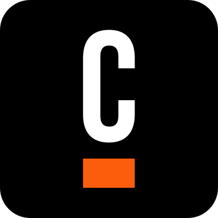
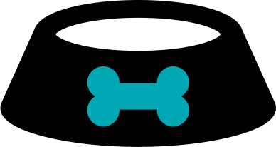
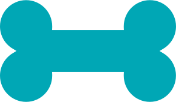
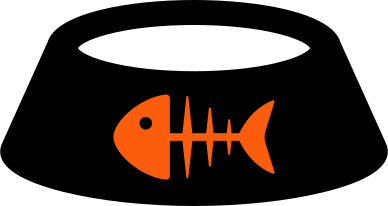
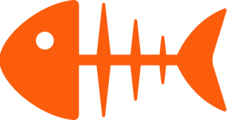

# Element Template SVG Converter
Takes SVGs and converts them for use in Camunda Modeler Element Templates

The main class is src/main/java/org/svg/utilities/RescaleImage

Arguments to pass into the main class:

"SVG input file location" "Modeler Element Template file location" "Icon width in pixels" "Element Template ID" "Element Template Name/Description/etc" "What BPMN elements it will apply to"

The goal is to create a stable of SVG icons for the community and have a converter for folks to create their own.

# Converted SVGs
If you don't want to run the SVGs through the converter you can simply copy and paste these ready made snippets into the ```icon: { contents``` portion of your Element Template entry. They have been created at a width of 18px. Click on image to be brought to the Element Template SVG snippet.


<h2> Camunda Logos </h2>

<table>
<tr><td width="150px" align=center><b>Black</b></td><td width="150px" align=center><b>Orange</b></td><td width="150px" align=center><b>28px wide</b></td><td width="150px" align=center><b>Animated Classic</b></td><td width="150px" align=center><b>Classic</b></td></tr>
<tr><td><a href="./converted-svg-snippets/CamundaLogo.txt"></a></td><td><a href="./converted-svg-snippets/orangeCamundaLogo.txt"></a></td><td><a href="./converted-svg-snippets/camunda.txt"></a></td><td><a href="./converted-svg-snippets/CamundaClassicLogoAnimated.txt"></a></td><td><a href="./converted-svg-snippets/CamundaClassicLogo.txt"></a></td></tr>
<table>

<h2> Camundamojis </h2>

<table>
<tr><td width="150px" align=center><b>Happy</b></td><td width="150px" align=center><b>Neutral</b></td><td width="150px" align=center><b>Concerned</b></td><td width="150px" align=center><b>Mad</b></td></tr>
<tr><td><a href="./converted-svg-snippets/happy.txt"></a></td><td><a href="./converted-svg-snippets/meh.txt"></a></td><td><a href="./converted-svg-snippets/emojiConcerned.txt"></a></td><td><a href="./converted-svg-snippets/mad.txt"></a></td></tr>
<table>


<h2> Friends </h2>

| <div style="width:150px">Extraterrestrial </div> | <div style="width:150px">Blue Robot</div>|<div style="width:150px">Yellow Robot</div>|<div style="width:150px">Green Monster</div>|<div style="width:150px">Orange Monster</div>|
| :---: | :---: | :---: | :---: | :---: |
|[](./converted-svg-snippets/alien.txt)|[](./converted-svg-snippets/blueRobot.txt)|[](./converted-svg-snippets/yellowRobot.txt)|[](./converted-svg-snippets/greenMonster.txt)|[](./converted-svg-snippets/orangeMonster.txt)|

<h2> Coffee </h2>

| <div style="width:150px">Coffee cup</div> | <div style="width:150px">Grey coffee cup</div>|<div style="width:150px">Coffee circle</div>|<div style="width:150px">Yellow coffee circle</div>|
| :---: | :---: | :---: | :---: |
|[](./converted-svg-snippets/coffeeCup.txt)|[](./converted-svg-snippets/greyCoffeeCup.txt)|[](./converted-svg-snippets/coffeeCircle.txt)|[](./converted-svg-snippets/yellowCoffeeCircle.txt)|

<h2> Other logos </h2>

|<div style="width:150px">Github</div>|<div style="width:150px">Slack</div>|<div style="width:150px">Stack Overflow</div>|<div style="width:150px">Twitter</div>|<div style="width:150px">YouTube</div>|<div style="width:150px">Facebook</div>|
| :---: | :---: | :---: | :---: | :---: | :---: |
|[](./converted-svg-snippets/github_black.txt)|[](./converted-svg-snippets/slack_black.txt)|[](./converted-svg-snippets/stack-overflow_black.txt)|[](./converted-svg-snippets/twitter_black.txt)|[](./converted-svg-snippets/youtube_black.txt)|[](./converted-svg-snippets/facebook_black.txt)|


<h2> For the dogs </h2>

| <div style="width:150px">Dog food bowl</div> | <div style="width:150px">Teal dog food bowl</div>|<div style="width:150px">Dog bone</div>|<div style="width:150px">Teal dog bone</div>|
| :---: | :---: | :---: | :---: |
|[](./converted-svg-snippets/dogFoodBowl.txt)|[](./converted-svg-snippets/tealDogFoodBowl.txt)|[](./converted-svg-snippets/dogBone.txt)|[](./converted-svg-snippets/tealDogBone.txt)|

<h2> For the cats </h2>

| <div style="width:150px">Cat food bowl</div> | <div style="width:150px">Orange cat food bowl</div>|<div style="width:150px">Cat treat</div>|<div style="width:150px">Orange cat treat</div>|
| :---: | :---: | :---: | :---: |
|[](./converted-svg-snippets/catFoodBowl.txt)|[](./converted-svg-snippets/orangeCatFoodBowl.txt)|[](./converted-svg-snippets/fishTreat.txt)|[](./converted-svg-snippets/orangeFishTreat.txt)|

<h2> Huh? </h2>

| <div style="width:150px">Question mark</div> | <div style="width:150px">Blue question mark</div>|
| :---: | :---: |
|[](./converted-svg-snippets/questionMark.txt)|[](./converted-svg-snippets/blueQuestionMark.txt)|

| Something | Else |
|---------------|------------------------------------------------------------------------------------------------------|
| Short | This is longer this is longer this is longer this is longer this is longer this is longer this is longer this is longer this is longer this is longer this is longer this is longer |
| Short | |

An example of its use in an Element Template entry (see contents):

```
{
	"$schema": "https://unpkg.com/@camunda/zeebe-element-templates-json-schema/resources/schema.json",
	"name": "Feed the cat",
	"icon": { "contents": "data:image/svg+xml,%3Csvg xmlns='http://www.w3.org/2000/svg' width='18' height='9.565979' viewBox='0 0 18 9.565979' %3E%3Ccircle r='0.29226804' cx='6.7592783' cy='5.7293816'/%3E%3Cpath d='M 17.902576 6.643299 h 0.0046391753 L 15.810308 1.980928 h -0.0046391753 c 0.0 -0.0046391753,-0.0046391753 -0.013917526,-0.0046391753 -0.018556701 C 15.406701 0.6170103,12.094331 0.0,9.0 0.0 S 2.5932992 0.6170103,2.1989691 1.9623711 c -0.0046391753 0.0046391753,-0.0046391753 0.013917526,-0.0046391753 0.018556701 h -0.0046391753 L 0.0927835 6.643299 h 0.0046391753 c -0.064948454 0.12525773,-0.097422674 0.25979382,-0.097422674 0.39896908 c 0.0 0.75618553,0.9881443 1.3824742,2.931959 1.8695877 c 1.7025774 0.42216498,3.8551545 0.6541237,6.0680413 0.6541237 s 4.3654637 -0.23195876,6.0680413 -0.6541237 c 1.9484537 -0.4824742,2.931959 -1.1134021,2.931959 -1.8695877 C 18.0 6.903093,17.967525 6.7685566,17.902576 6.643299 L 17.902576 6.643299 M 12.32165 6.634021 l 0.42216498 1.3685567 c 0.013917526 0.041752577,-0.027835052 0.07886598,-0.06958763 0.064948454 c -0.93247426 -0.35721648,-1.401031 -1.1690723,-1.563402 -1.5262887 h -0.3618557 l -0.06958763 0.61237115 c -0.0046391753 0.05103093,-0.08350515 0.05103093,-0.08814433 0.0 l -0.06958763 -0.61237115 h -0.61237115 l -0.12525773 1.1551546 c -0.0046391753 0.05103093,-0.08350515 0.05103093,-0.08814433 0.0 l -0.12525773 -1.1551546 h -0.64484537 l -0.185567 1.6979381 c -0.0046391753 0.05103093,-0.08350515 0.05103093,-0.08814433 0.0 l -0.185567 -1.6979381 h -0.5798969 v 1.6283505 c 0.0 0.10206186,-0.08814433 0.18092784,-0.19020618 0.17164949 c -1.164433 -0.11597938,-2.4355671 -1.2386599,-2.4355671 -1.9762886 s 1.271134 -1.8649485,2.4355671 -1.9762886 c 0.10206186 -0.0092783505,0.19020618 0.06958763,0.19020618 0.17164949 v 1.6283505 h 0.5798969 l 0.185567 -1.6979381 c 0.0046391753 -0.05103093,0.08350515 -0.05103093,0.08814433 0.0 l 0.185567 1.6979381 h 0.64484537 l 0.12525773 -1.1551546 c 0.0046391753 -0.05103093,0.08350515 -0.05103093,0.08814433 0.0 l 0.12525773 1.1551546 h 0.61237115 l 0.06958763 -0.61237115 c 0.0046391753 -0.05103093,0.08350515 -0.05103093,0.08814433 0.0 l 0.06958763 0.61237115 h 0.3618557 c 0.1670103 -0.35721648,0.63092786 -1.1690723,1.563402 -1.5262887 c 0.041752577 -0.013917526,0.08350515 0.023195876,0.06958763 0.064948454 l -0.42216498 1.3685567 C 12.265979 6.272165,12.265979 6.4577317,12.32165 6.634021 L 12.32165 6.634021 M 13.022165 2.8716495 c -1.0716496 0.28298968,-2.5005155 0.43608245,-4.022165 0.43608245 s -2.9505155 -0.15309279,-4.022165 -0.43608245 C 3.8922682 2.5886598,3.623196 2.2917526,3.6185567 2.2360826 c 0.0046391753 -0.032474227,0.08814433 -0.13917527,0.34793815 -0.27371135 c 0.20876288 -0.11134021,0.528866 -0.23659794,1.0113401 -0.36649486 c 1.0716496 -0.28298968,2.5005155 -0.43608245,4.022165 -0.43608245 s 2.9505155 0.15309279,4.022165 0.43608245 c 0.48711342 0.12525773,0.80721647 0.25515464,1.0159794 0.36649486 c 0.25979382 0.13453609,0.34329897 0.2412371,0.34793815 0.27371135 C 14.372165 2.2917526,14.107733 2.5886598,13.022165 2.8716495 L 13.022165 2.8716495 z'/%3E%3C/svg%3E"
		},
	"description": "Feed the cat",
	"appliesTo": [
		"bpmn:UserTask"
	],
	"id": "catFoodBowl",
	"documentationRef": "https://docs.camunda.io",
	"elementType": {
		"value": "bpmn:UserTask"
	},
	"properties": [
		{
			"binding": {
				"name": "name",
				"type": "property"
			},
			"type": "String",
			"value": "Feed the cat"
		}
	]
}
```


